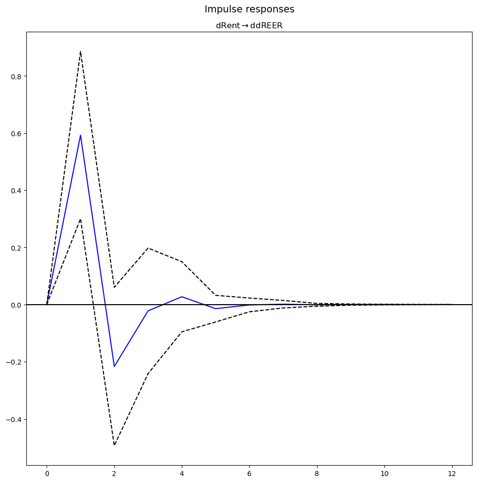

# 🇪🇬 Egypt Dutch Disease Analysis (2016–2025)
### *A Vector Autoregression (VAR) Approach to Rentier Inflows*

[](https://colab.research.google.com/drive/1EntjELuJf9GlZ1WTkEiDPYH09oLcMD6G)

---

## Project Overview

This repository contains a macroeconometric investigation into the Dutch Disease phenomenon in Egypt following the 2016 currency floatation. The study examines how large foreign-currency inflows—originating from the **Suez Canal**, **workers’ remittances**, and **foreign direct investment (FDI)**—affect the **Real Effective Exchange Rate (REER)** and the **manufacturing sector**.

To capture the full scope of external inflows, the analysis constructs a **composite rentier variable** aggregating Suez revenues, remittances, and net FDI, providing a more comprehensive test of Dutch Disease mechanisms than single-source analyses.

---

## Research Questions

1. **The Spending Effect:**  
   To what extent do aggregate rentier inflows drive volatility and appreciation in Egypt’s real effective exchange rate?

2. **The Resource Movement Effect:**  
   Does exchange-rate appreciation transmit a negative shock to manufacturing output, or is the sector insulated by structural characteristics?

---

## Methodology & Data

- **Frequency:** Quarterly data (2016/17 Q1 – 2024/25 Q3)
- **Variables:**
  - Composite Rentier Inflows (`dRent`)
  - Exchange Rate Dynamics (`ddREER`, second difference of log REER)
  - Manufacturing Output (`dManufacturing`)
  - Inflation (`dCPI`)
- **Model:** 4-variable Vector Autoregression (VAR) in first and second differences
- **Estimation Tools:** Granger causality tests, Impulse Response Functions (IRF & GIRF), and Forecast Error Variance Decomposition (FEVD)
- **Diagnostics:**  
  All estimated VAR models pass stability checks (all eigenvalues lie within the unit circle) and Ljung–Box Portmanteau tests for residual autocorrelation (p ≈ 0.97), indicating well-specified dynamics.

All results are interpreted as **short-run dynamics**; no long-run equilibrium is imposed due to mixed integration orders across variables.

---

## Key Findings: The “Natural Hedge” Thesis

The empirical results identify a **High-Elasticity, Low-Transmission form of Dutch Disease** in Egypt:

- **Strong Spending Effect:**  
  Shocks to aggregate rentier inflows explain **31.4%** of the forecast error variance of the REER, indicating that Egypt’s exchange rate is structurally anchored to external hard-currency inflows.

- **Muted Real-Sector Transmission:**  
  Despite pronounced exchange-rate sensitivity, REER shocks explain only **6.8%** of manufacturing output volatility. Manufacturing dynamics are instead dominated by sector-specific shocks.

- **Structural Interpretation — A “Natural Hedge”:**  
  The absence of significant Granger causality from the REER to manufacturing output suggests that the negative competitiveness effects of currency appreciation are offset by lower input costs. This pattern is consistent with Egypt’s **import-dependent industrial structure**, where cheaper imported intermediate goods partially neutralize Dutch Disease pressures in the short run.

---

## Visual Evidence
### Impulse Response: Rent → Exchange Rate



### Impulse Response: Exchange Rate → Manufacturing


### Forecast Error Variance Decomposition (Manufacturing)

.png)


The repository includes impulse response functions and variance decomposition plots illustrating:
- The short-lived but statistically significant response of the REER to rent shocks
- The weak and transitory response of manufacturing output to exchange-rate movements

These visualizations reinforce the conclusion of high exchange-rate elasticity with limited real-sector transmission.

---
## ▶️ Run the Analysis in Google Colab (No Local Setup Required)

The full econometric analysis notebook can be accessed and executed directly in **Google Colab**, allowing users to reproduce all results without installing Python locally.

👉 **Open the notebook in Colab:**  
[Open in Google Colab](https://colab.research.google.com/drive/1EntjELuJf9GlZ1WTkEiDPYH09oLcMD6G#scrollTo=bbf9d26d-6002-4a83-af2d-1b66f192838f)

### Instructions
1. Click the link above to open the notebook in Google Colab.
2. If prompted, sign in with a Google account.
3. Select **Runtime → Run all** to execute the full analysis.
4. The notebook will reproduce:
   - Data preprocessing and transformations
   - Stationarity tests
   - VAR estimation and diagnostics
   - Granger causality tests
   - Impulse Response Functions (IRF & GIRF)
   - Forecast Error Variance Decomposition (FEVD)

All computations are performed in the cloud, ensuring full reproducibility across systems.

## Installation & Usage

```bash
git clone https://github.com/ziadnasr2007/Suez_REER_VAR.git
pip install -r requirements.txt


[def]: outputs/figures/FEVD(Rent).png
